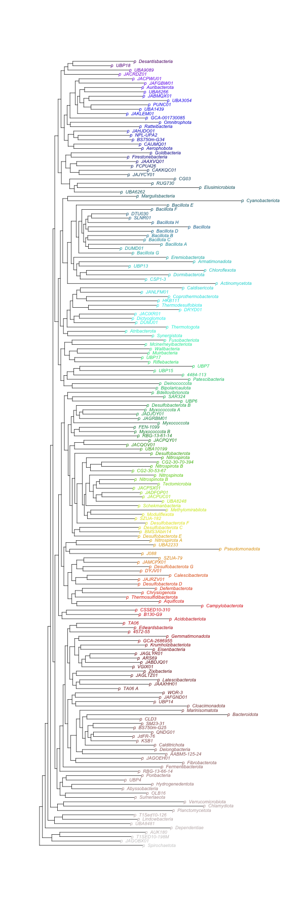

# EHI taxonomy colour
Repository containing the EHI taxonomy colouring standards. It contains the R code used to assign colours to bacterial phylums based on their phylogenetic position in the GTDB tree, as well as the reference table and examples.

The file [**ehi_taxonomy_colors_v2.r**](https://github.com/earthhologenome/EHI_taxonomy_colour/blob/main/ehi_taxonomy_colors_v2.r) contains the code used to generate the colours.

The file [**ehi_phylum_colors.tsv**](https://raw.githubusercontent.com/earthhologenome/EHI_taxonomy_colour/main/ehi_phylum_colors.tsv) is used as the phylum-level colouring standard of all EHI outputs.

The file [**phylum_tree.pdf**](https://github.com/earthhologenome/EHI_taxonomy_colour/blob/main/phylum_tree.pdf) contains the phylum-level GTDB tree coloured with the EHI colour standards.

 
